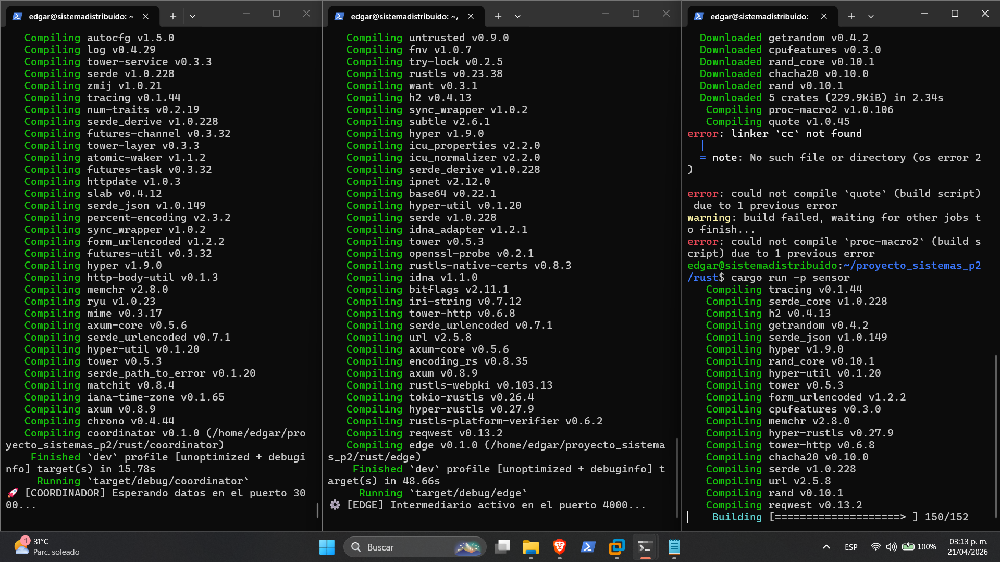
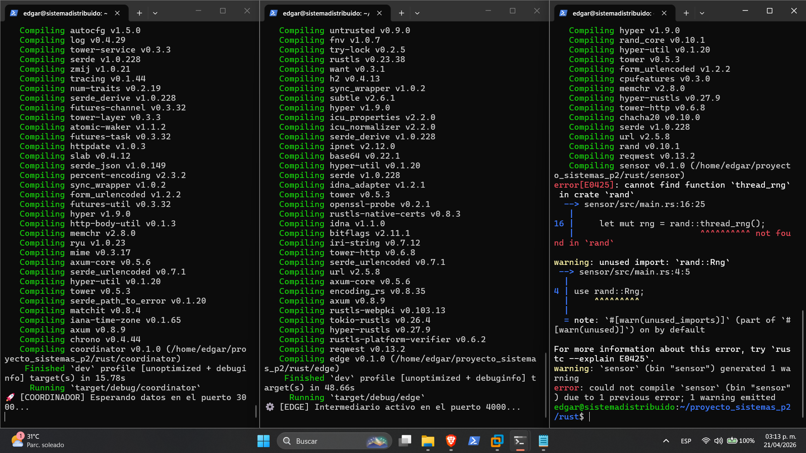

# Minuta de Reunión #02 - Sprint 1
**Fecha:** 22 de Abril, 2026 | **Hora:** 10:00 - 12:00
**Participantes:** Edgar Arreola

## Temas Discutidos
1. Depuración de errores de compilación en el entorno de Ubuntu Server.
2. Configuración de dependencias específicas para la generación de datos aleatorios.

## Decisiones Tomadas
* Instalar `build-essential` para resolver la ausencia del enlazador `cc`.
* Actualizar el código del Sensor para cumplir con la versión 0.10 de la crate `rand` (uso de `RngExt` y `random_range`).

## Evidencias de Resolución de Bloqueos

*Figura 1: Error detectado por falta de herramientas de compilación en la MV.*

*Figura 2: Ajuste de sintaxis por actualización de versión de la librería.*

## Tareas Generadas
* [x] Resolver errores de compilación.
* [x] Validar flujo completo Sensor-Edge-Coordinador.

Latencia:

