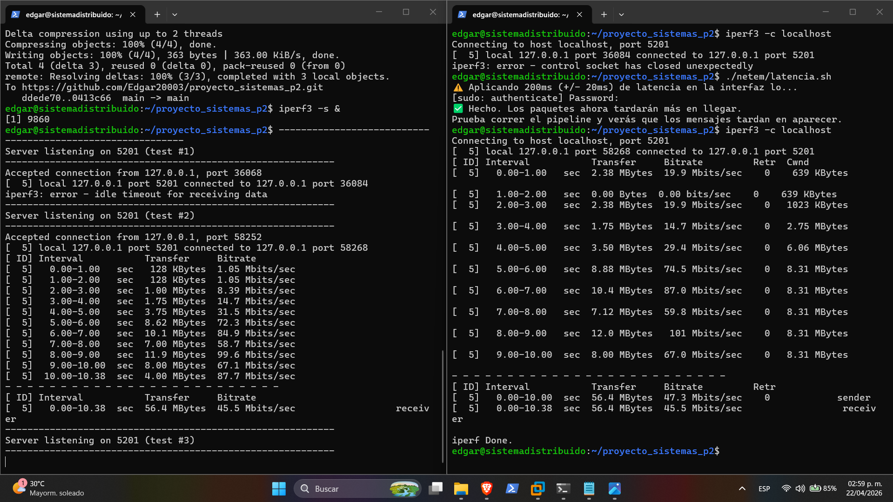

Los 6 Riesgos Técnicos
1.- Interacción netem vs WireGuard: Existe el riesgo de que las reglas de tc netem interfieran con la encapsulación de paquetes de WireGuard, 
afectando el MTU y causando desconexiones inesperadas del túnel.

2.- Race Conditions en Reconexiones: Al ser un sistema asíncrono con tokio, el nodo Edge podría intentar reconectarse al Coordinador mientras aún procesa
mensajes antiguos, generando inconsistencia en el estado de la conexión.

3.- Sincronización de Relojes: Para medir la latencia extremo a extremo (E2E), los contenedores deben tener sus relojes sincronizados;
de lo contrario, los timestamps del Sensor y el Coordinador no serán comparables.

4.- Saturación de Buffer (Backpressure): Durante los escenarios de alta latencia o pérdida de paquetes, los mensajes se acumularán en el Edge.
Si no se gestiona correctamente, esto podría agotar la memoria RAM del contenedor.

5.- Optimización de Imágenes Docker: Empaquetar binarios de Rust en imágenes estándar puede generar contenedores muy pesados (600MB+).
Se requiere una estrategia de "Multi-stage build" para mantener la infraestructura ligera.

6.- Orden de Dependencia en el Arranque: El Coordinador debe estar listo antes que el Edge, y el Edge antes que el Sensor.
Se requiere configurar correctamente el depends_on y "health checks" en Docker Compose.

## 3. Evidencias de Simulación de Red (iperf3)
Para validar el impacto del script de latencia, se realizaron pruebas de ancho de banda con `iperf3` en la interfaz local.

### Escenario: Red Degradada (Latencia 200ms)

*Figura 4: Caída del throughput y aumento de retransmisiones al aplicar tc netem.*
